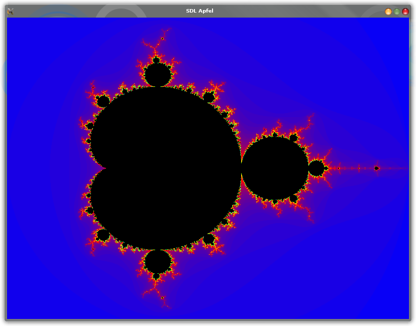

# sdl_apfel
Apfelmänchen mit SDL

###Unter Linux Kompilieren###
-----------------------

cd sdl_apfel/build-linux

cmake -D CMAKE_BUILD_TYPE=Release ..
make

###Unter Windows Kompilieren###
-------------------------

cd sdl_apfel/build

cmake -G "MinGW Makefiles" -D CMAKE_BUILD_TYPE=Release ..
make (mingw32-make)

###Windows Binary Cross Compilieren unter Linux mit MXE (mxe.cc)###
-------------------------------------------------------------------

Zum Cross Compilieren kann das cross_build.sh Skript benutzt werden

Bsp.: ./cross_build.sh ~/mxe i686 static
